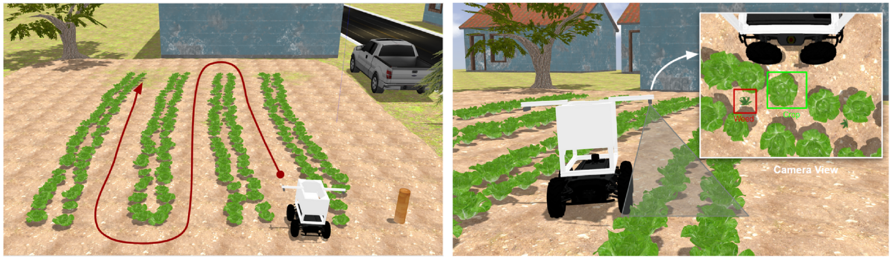
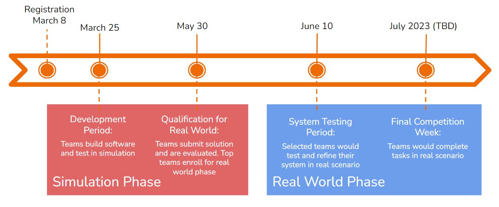

# Welcome to the 2023 Pan-African Robotics Competition Repository

<!-- ## Install GPS Sensor Plugin
`sudo apt-get install ros-noetic-hector-gazebo-plugins`

## Copy Farmland to Gazebo Models
`cp -r ~/catkin_ws/src/PARC-2023-EL/parc_robot/models/farmland ~/.gazebo/models`

## Run Tasks
Task 1
`roslaunch parc_robot parc_task1.launch`

Task 2
`roslaunch parc_robot parc_task2.launch`

Task 3
`roslaunch parc_robot parc_task3.launch` -->

### [Visit the Official Competition Documentation Here](https://parc-robotics.github.io/documentation-2023/introduction/)

Robotics and AI is revolutionizing the what and how we work today and will continue in the future. Today, robots are augmenting the capability of human workers in various industries: logistics, healthcare, agriculture, etc.

With growing global food insecurity and pressures from climate change, it is more important than ever to develop novel approaches to sustainable agriculture. The 2023 PARC Engineers League invites teams to reimagine how robotics and AI can steer the way to a more sustainable agriculture future for Africa.

The challenge of the competition is to build software to operate the PARC AgRobot (a wheeled mobile robot) to perform autonomous agricultural tasks including: precise navigating through a farm, detecting weeds within crop rows using computer vision and autonomously planting seeds on the farm.

### Competition Timeline:

